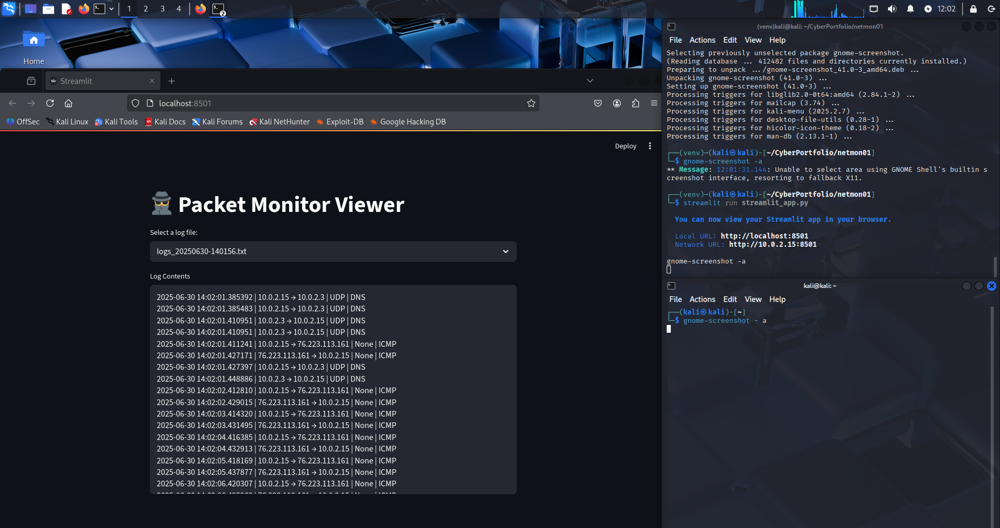

# 🛡️ netmon01 – Home Network Threat Monitor

## 📘 Project Overview
`netmon01` is a Python-based script that captures live network traffic and detects basic suspicious activity. It uses the `pyshark` library to interface with Wireshark's TShark engine, printing and logging traffic in real-time. This is the first project in my Cloud + Industrial Cybersecurity portfolio, designed to build practical, defensive security skills.

## 🔧 Tools & Technologies
- Python 3
- PyShark (TShark wrapper)
- Wireshark & TShark
- Linux (Kali)
- Virtual Environment (venv)
- Log-based detection logic

### 📸 Screenshots

**Packet Capture Output:**


**Streamlit Log Viewer:**


## 🎯 Learning Objectives
- Learn to sniff live network packets using Python
- Identify suspicious activity such as Telnet usage (port 23)
- Log traffic to a timestamped log file
- Work inside isolated Python environments for safe, portable development

- Packet analysis  
- Python scripting  
- Logging and documentation  
- Building infosec tools from scratch

---

## 🛠️ Features

- 📡 **Live packet capture** using `pyshark.LiveCapture`
- **Logs traffic details**: source IP, destination IP, protocol
- **Flags Telnet (port 23)** usage as insecure
- 🧾 Output saved to log file with timestamp
- 🔄 Built for continuous improvement (alert logic, CLI filters, DNS parsing)

---

## 📦 Requirements

- Python 3.10+
- Kali Linux or Linux distro (for capture privileges)
- Wireshark / TShark installed
- Virtual environment (recommended)

### Install Dependencies

```bash
python3 -m venv venv
source venv/bin/activate
pip install pyshark streamlit
## Project Structure
