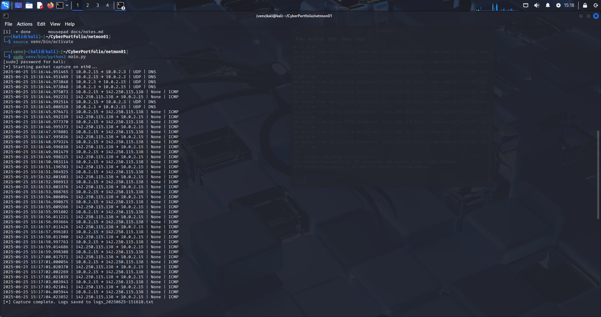

# 🛡️ netmon01 – Home Network Threat Monitor

## 📘 Project Overview

`netmon01` is a lightweight, Python-based network monitoring tool that captures and logs live traffic using the `pyshark` wrapper for Wireshark's TShark engine. It’s designed for learning packet analysis and threat detection on local networks. This is the first project in my **Cloud + Industrial Cybersecurity** portfolio, focused on developing real-world, defensive security skills.

---

## 🔧 Tools & Technologies

- **Python 3**
- **PyShark** (TShark wrapper)
- **Wireshark & TShark**
- **Kali Linux**
- **Virtual Environment (venv)**
- **Log-based detection logic**
- **Streamlit** (dashboard visualization)

---

## 🎯 Learning Objectives

- Capture and inspect live packets using Python
- Log source/destination IP, protocol, and layer data
- Flag insecure Telnet traffic (port 23) in logs
- Maintain clean logs with timestamps
- Operate entirely in isolated environments
- Prepare for integration into cloud or ICS/OT security toolkits

---

## 🛠️ Features

- 📡 **Real-time Packet Capture** with `pyshark.LiveCapture`
- 🧾 **Traffic Logging**: Saves traffic to timestamped log files
- 🚨 **Basic Alerting**: Flags Telnet traffic (port 23) for review
- 🧰 **Portable Setup**: Uses Python virtual environments
- 📊 **Visual Viewer**: Streamlit dashboard to browse and inspect logs

---

## 📸 Screenshots

**Packet Capture Output:**


**Streamlit Log Viewer:**


---

## 📦 Requirements

- Python 3.10+
- Kali Linux (or any Linux distro with TShark access)
- Wireshark & TShark
- `venv` for isolated Python environments

---

## 🚀 Setup Instructions

### Clone & Initialize
```bash
git clone https://github.com/tzsmit/netmon01.git
cd netmon01
